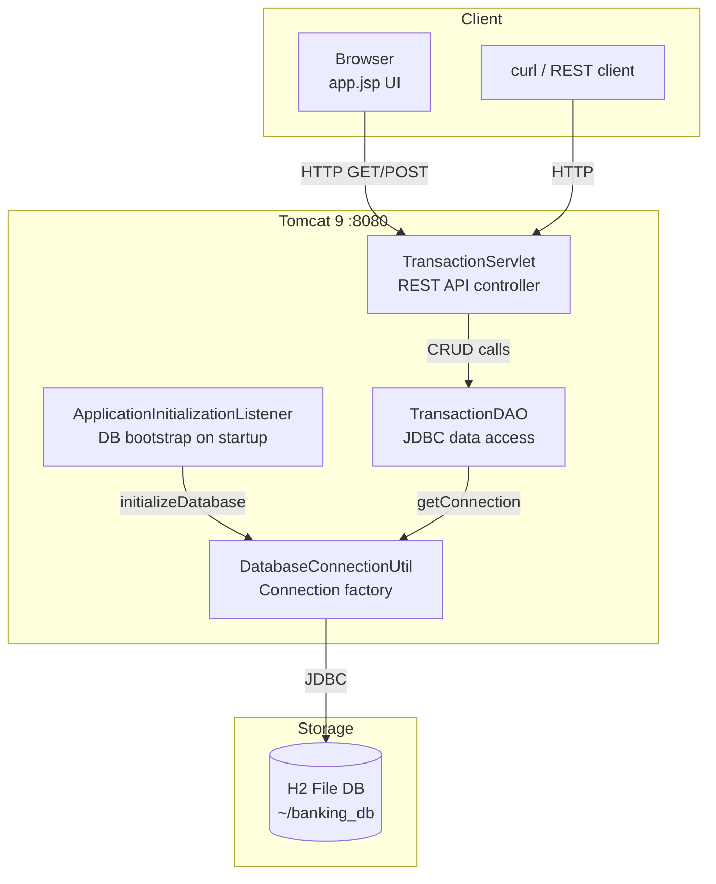
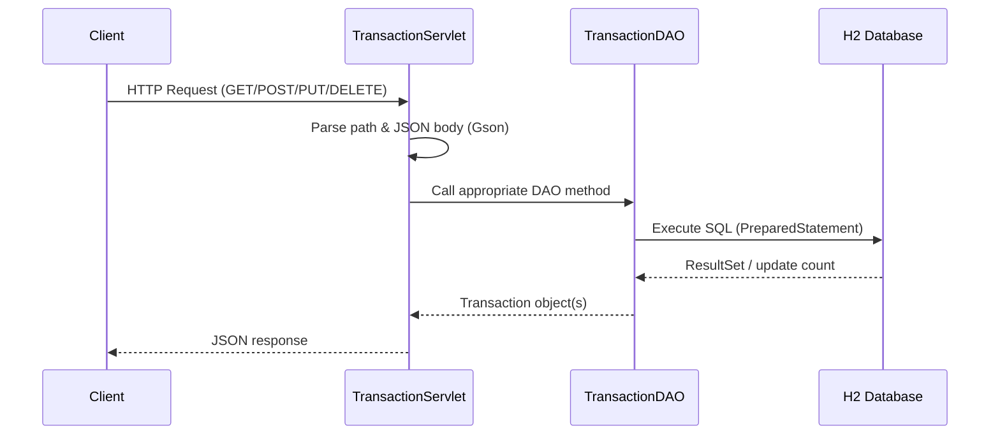

# Banking Transaction Analyzer — Design Document

## Overview

The Banking Transaction Analyzer is a servlet-based web application that provides a REST API and browser UI for managing and analyzing banking transactions. It follows a classic **three-tier architecture**: presentation (JSP/HTML), business logic (Servlet), and data access (DAO/JDBC), all packaged as a single WAR deployable on Apache Tomcat.

---

## Architecture Diagram



---

## Request Flow



---

## Component Details

### 1. `Transaction` (Model)

| Aspect | Detail |
|--------|--------|
| Package | `com.banking.analyzer.model` |
| Role | Domain object representing a single CREDIT or DEBIT transaction |
| Fields | `id`, `accountNumber`, `transactionType`, `amount`, `transactionDate`, `description`, `balanceAfter`, `createdAt` |
| Notes | Uses `BigDecimal` for monetary precision; `LocalDateTime` for timestamps. Serialised to/from JSON by Gson. |

---

### 2. `TransactionDAO` (Data Access)

| Aspect | Detail |
|--------|--------|
| Package | `com.banking.analyzer.dao` |
| Role | Encapsulates all SQL operations against the `transactions` table |
| Key methods | `getAllTransactions`, `getTransactionById`, `getTransactionsByAccount`, `getTransactionsByDateRange`, `saveTransaction`, `updateTransaction`, `deleteTransaction`, `getTotalCredits`, `getTotalDebits` |
| Security | All queries use `PreparedStatement` to prevent SQL injection |
| Error handling | Catches `SQLException`, logs via `java.util.logging`, returns null/empty/false on failure |

---

### 3. `TransactionServlet` (REST Controller)

| Aspect | Detail |
|--------|--------|
| Package | `com.banking.analyzer.servlet` |
| URL pattern | `/api/transactions`, `/api/transactions/*` |
| Role | HTTP request routing, JSON serialisation/deserialisation, error responses |
| Dependencies | `TransactionDAO`, `Gson` |

#### Supported API Endpoints

| Method | Path | Description | Status |
|--------|------|-------------|--------|
| GET | `/api/transactions` | List all transactions | ✅ Verified |
| GET | `/api/transactions/{id}` | Get transaction by ID | ✅ Verified |
| POST | `/api/transactions` | Create a new transaction | ✅ Verified |
| PUT | `/api/transactions/{id}` | Update an existing transaction | ✅ Verified |
| DELETE | `/api/transactions/{id}` | Delete a transaction | ✅ Verified |
| GET | `/api/transactions/account/{acct}` | Transactions for an account | ✅ Verified |
| GET | `/api/transactions/account/{acct}/summary` | Account summary (count, credits, debits, balance) | ✅ Verified |
| GET | `/api/transactions/account/{acct}/balance` | Current balance | ✅ Verified |
| GET | `/api/transactions/account/{acct}/credits` | Total credits | ✅ Verified |
| GET | `/api/transactions/account/{acct}/debits` | Total debits | ✅ Verified |

#### Request body (POST/PUT)

```json
{
  "accountNumber": "ACC001",
  "transactionType": "CREDIT",
  "amount": 15000.00,
  "transactionDate": "2026-04-29 10:00:00",
  "description": "Salary",
  "balanceAfter": 15000.00
}
```

`transactionType`: `CREDIT` or `DEBIT`

#### JSON date format

All dates use `yyyy-MM-dd HH:mm:ss`. Custom Gson serializers/deserializers handle `LocalDateTime` conversion.

#### Response examples (verified against Docker container)

**POST /api/transactions** → `201 Created`
```json
{
  "id": 7,
  "accountNumber": "ACC001",
  "transactionType": "CREDIT",
  "amount": 15000.0,
  "transactionDate": "2026-04-29 10:00:00",
  "description": "Salary",
  "balanceAfter": 15000.0
}
```

**GET /api/transactions/{id}** → `200 OK`
```json
{
  "id": 7,
  "accountNumber": "ACC001",
  "transactionType": "CREDIT",
  "amount": 15000.0,
  "transactionDate": "2026-04-29 10:00:00",
  "description": "Salary",
  "balanceAfter": 15000.0,
  "createdAt": "2026-04-29 16:43:36"
}
```

**GET /api/transactions/account/{acct}/summary** → `200 OK`
```json
{
  "accountNumber": "ACC001",
  "transactionCount": 8,
  "totalCredits": 41000.0,
  "totalDebits": 14700.0,
  "balance": 26300.0
}
```

**GET /api/transactions/account/{acct}/balance** → `200 OK`
```json
{ "balance": 26300.0 }
```

**GET /api/transactions/account/{acct}/credits** → `200 OK`
```json
{ "totalCredits": 41000.0 }
```

**GET /api/transactions/account/{acct}/debits** → `200 OK`
```json
{ "totalDebits": 14700.0 }
```

**DELETE /api/transactions/{id}** → `200 OK`
```json
{ "message": "Transaction deleted successfully" }
```

**Error — GET /api/transactions/999** → `404`
```json
{ "error": "Transaction not found" }
```

#### Example curl commands

```bash
# Create transaction
curl -X POST http://localhost:8080/transaction-analyzer/api/transactions \
  -H "Content-Type: application/json" \
  -d '{"accountNumber":"ACC001","transactionType":"CREDIT","amount":15000.00,"transactionDate":"2026-04-29 10:00:00","description":"Salary","balanceAfter":15000.00}'

# Get all
curl http://localhost:8080/transaction-analyzer/api/transactions

# Get by ID
curl http://localhost:8080/transaction-analyzer/api/transactions/1

# Update
curl -X PUT http://localhost:8080/transaction-analyzer/api/transactions/1 \
  -H "Content-Type: application/json" \
  -d '{"accountNumber":"ACC001","transactionType":"CREDIT","amount":20000.00,"transactionDate":"2026-04-29 10:00:00","description":"Updated Salary","balanceAfter":20000.00}'

# Delete
curl -X DELETE http://localhost:8080/transaction-analyzer/api/transactions/1

# Account summary
curl http://localhost:8080/transaction-analyzer/api/transactions/account/ACC001/summary

# Balance / Credits / Debits
curl http://localhost:8080/transaction-analyzer/api/transactions/account/ACC001/balance
curl http://localhost:8080/transaction-analyzer/api/transactions/account/ACC001/credits
curl http://localhost:8080/transaction-analyzer/api/transactions/account/ACC001/debits
```

---

### 4. `ApplicationInitializationListener` (Lifecycle)

| Aspect | Detail |
|--------|--------|
| Package | `com.banking.analyzer.servlet` |
| Role | `ServletContextListener` that runs on deployment to ensure the DB schema exists |
| Behaviour | Calls `DatabaseConnectionUtil.initializeDatabase()` which creates the `transactions` table if absent |

---

### 5. `DatabaseConnectionUtil` (Infrastructure)

| Aspect | Detail |
|--------|--------|
| Package | `com.banking.analyzer.util` |
| Role | JDBC connection factory and one-time schema creation |
| Database | H2 file-mode at `~/banking_db` with `AUTO_SERVER=TRUE` |
| Key methods | `getConnection()` — returns a new JDBC connection; `initializeDatabase()` — DDL execution |
| Extensibility | Constants can be swapped to point at MySQL or another RDBMS |

---

### 6. `app.jsp` (UI — Frontend)

| Aspect | Detail |
|--------|--------|
| Location | `src/main/webapp/app.jsp` |
| Role | Single-page browser interface for viewing and adding transactions |
| Technology | Pure HTML + inline CSS + vanilla JavaScript (no frameworks) |

#### UI Features

| Feature | Description |
|---------|-------------|
| Account statistics | Displays total credits, total debits, and balance for the selected account |
| Add transaction form | Fields for account number, type (credit/debit), amount, date, time, description |
| Transaction table | Sortable list showing all transactions with type badges and color-coded amounts |
| Filter: large transactions | Button to show only transactions greater than ₹10,000 |
| Sort by amount | Cycles through ascending / descending / unsorted |
| Reset | Restores full unfiltered view |
| Currency | All monetary values displayed in Indian Rupee (₹) |

#### Client-Server Interaction

The UI communicates with the backend exclusively via `fetch()` calls to the REST API endpoints. No server-side rendering of transaction data occurs — the JSP serves as a static shell that bootstraps the JavaScript application.

---

## Database Schema

```sql
CREATE TABLE transactions (
    id               INT PRIMARY KEY AUTO_INCREMENT,
    account_number   VARCHAR(50)    NOT NULL,
    transaction_type VARCHAR(20)    NOT NULL,
    amount           DECIMAL(15,2)  NOT NULL,
    transaction_date TIMESTAMP      NOT NULL,
    description      VARCHAR(500),
    balance_after    DECIMAL(15,2)  NOT NULL,
    created_at       TIMESTAMP DEFAULT CURRENT_TIMESTAMP
);
```

---

## Technology Stack

| Layer | Technology | Purpose |
|-------|-----------|---------|
| Language | Java 11 | Application code |
| Web framework | Java Servlets 4.0 | HTTP handling |
| Data access | JDBC | Database operations |
| Database | H2 2.1.214 | Embedded file-based storage |
| JSON | Gson 2.10.1 | Serialisation / deserialisation |
| Build | Maven 3.6+ | Dependency management & packaging |
| Server | Tomcat 7 (embedded via Maven plugin) | Application server |
| Frontend | HTML / CSS / JavaScript | Browser UI |

---

## Validation

### UI Validations (`app.jsp` — `addTransaction()`)

| Check | Condition | User Feedback |
|-------|-----------|---------------|
| Amount is positive | `amount <= 0` or empty | Status message: "Please enter a valid amount." |
| Account number present | empty string after trim | Status message: "Please enter an account number." |
| HTML `min` attribute | `<input min="0">` on amount field | Browser prevents negative input via spinner |
| HTML `type="number"` | amount field | Browser rejects non-numeric input |

### REST API Validations (`TransactionServlet`)

| Check | Location | Behaviour |
|-------|----------|-----------|
| Path ID is numeric | `doGet`, `doPut`, `doDelete` | Regex `"/\\d+"` — returns 400 "Invalid transaction ID" if non-numeric |
| Transaction exists (GET) | `doGet` by ID | Returns 404 "Transaction not found" |
| Transaction exists (PUT) | `doPut` | Returns 404 "Transaction not found" if update affects 0 rows |
| Transaction exists (DELETE) | `doDelete` | Returns 404 "Transaction not found" if delete affects 0 rows |
| Account path format | `handleAccountRequest` | Returns 400 "Invalid account path" if path has < 3 segments |
| Valid action | `handleAccountRequest` switch | Returns 400 "Invalid action: {action}" for unknown sub-paths |
| JSON parseable | Gson `fromJson()` | Returns 500 with parse error message if body is malformed |
| Date format | Gson `LocalDateTime` deserializer | Returns 500 if date doesn't match `yyyy-MM-dd HH:mm:ss` |

### NOT Validated by the REST API

| Missing Validation | Risk |
|-------------------|------|
| Negative or zero amount | API accepts `amount: -500` — no rejection |
| Empty/null `accountNumber` | SQL insert may fail with DB constraint or store null |
| Invalid `transactionType` | Values other than `CREDIT`/`DEBIT` accepted silently |
| Missing required fields | Null fields pass through to DAO, may cause `NullPointerException` or DB error |
| Amount precision | Arbitrarily large values accepted (limited only by `DECIMAL(15,2)` at DB level) |
| `balanceAfter` correctness | API trusts the client-provided value — no server-side recalculation |

---

