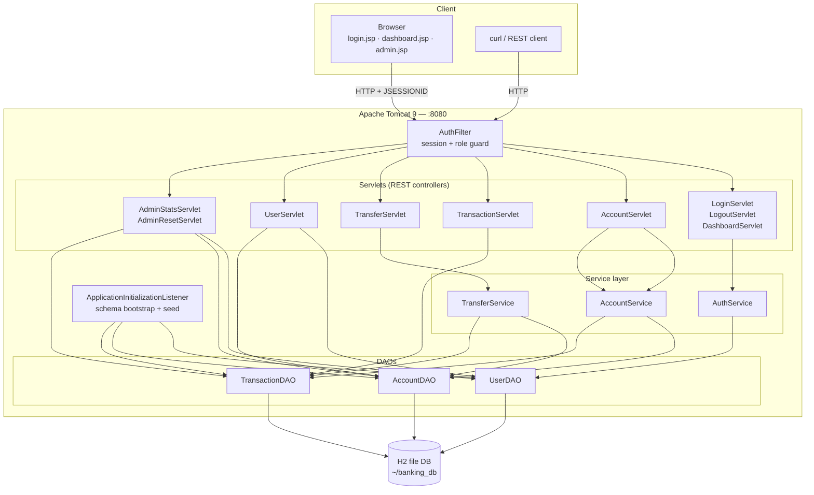
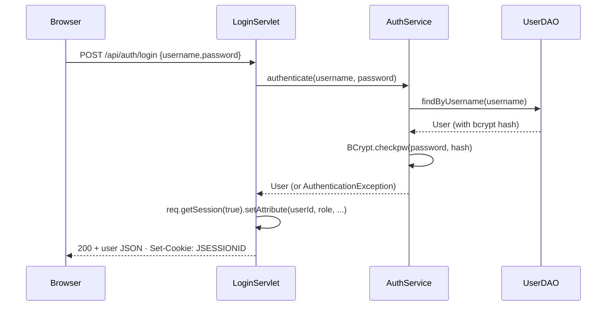
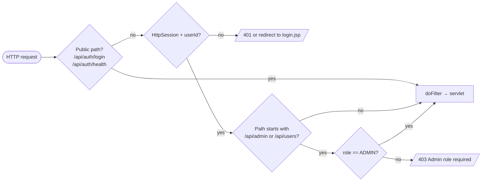
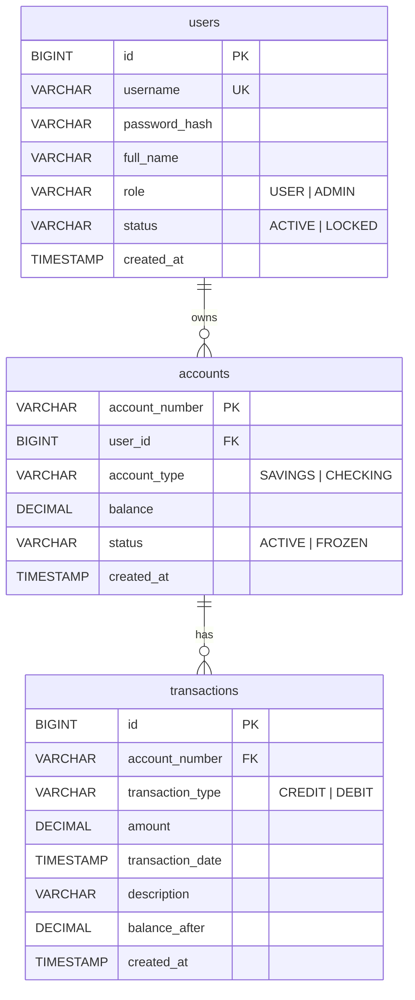

# Pragati Bank — Design Document

A minimal but multi-user retail banking demo built on **Java Servlets + JSP +
JDBC + H2**. The app is structured as a classic three-tier MVC architecture
with explicit authentication, authorisation and a service layer that enforces
banking invariants (no negative balances, no transfers from frozen accounts,
atomic transfers, etc.).

> Educational project. Money, accounts and customers are fictitious.

---

## 1. High-level architecture



### Layers

| Layer | Responsibilities |
|-------|------------------|
| **Presentation** (JSP + vanilla JS) | Render UI shell, call the REST API via `fetch`, format ₹ amounts, manage login/redirect flows. |
| **Web / control** (Servlets + AuthFilter) | HTTP routing, JSON marshalling (Gson), session creation, role enforcement. No business logic. |
| **Service** | Banking invariants: balance never goes negative, account must be ACTIVE, transfers are atomic, passwords are hashed. |
| **Data access** (DAOs) | Pure JDBC with `PreparedStatement`. One DAO per table; no SQL leaks outside this layer. |
| **Persistence** | H2 in file mode at `~/banking_db` (`AUTO_SERVER=TRUE`). |

---

## 2. Authentication & authorisation

### Sequence — login



### `AuthFilter` (URL: `/api/*`, `/dashboard.jsp`, `/admin.jsp`, `/statement.jsp`, `/app.jsp`)



* **Sessions** are standard `HttpSession` cookies (`JSESSIONID`). Stored
  attributes: `userId` (Long), `username`, `role`, `fullName`.
* **Passwords** are hashed with BCrypt (`org.mindrot:jbcrypt`) at signup time;
  only the hash is persisted.
* **Admin-only prefixes:** `/api/users`, `/api/admin`. Everything else under
  `/api/*` only requires an authenticated session; ownership checks happen in
  the servlets (e.g. `AccountServlet` rejects `deposit` to an account the
  caller doesn't own with `403`).

---

## 3. Data model



The schema is created on application startup by
`DatabaseConnectionUtil.initializeDatabase()` using `CREATE TABLE IF NOT EXISTS`,
so the DB is safe to drop or wipe at any time. Demo data is loaded by
`DataSeeder.seedIfEmpty()` only when the `users` table is empty.

### Storage

H2 in file mode at `~/banking_db` (configurable via the `user.home` JVM
property — the Docker image sets it to `/app/data` so the DB lands on the
mounted volume). Created automatically on first startup.

### DDL

```sql
CREATE TABLE users (
    id            INT PRIMARY KEY AUTO_INCREMENT,
    username      VARCHAR(50)  NOT NULL UNIQUE,
    password_hash VARCHAR(100) NOT NULL,
    full_name     VARCHAR(100) NOT NULL,
    role          VARCHAR(20)  NOT NULL,    -- USER | ADMIN
    status        VARCHAR(20)  NOT NULL,    -- ACTIVE | LOCKED
    created_at    TIMESTAMP DEFAULT CURRENT_TIMESTAMP
);

CREATE TABLE accounts (
    account_number VARCHAR(50)    PRIMARY KEY,
    user_id        INT            NOT NULL,
    account_type   VARCHAR(20)    NOT NULL, -- SAVINGS | CHECKING
    balance        DECIMAL(15, 2) NOT NULL DEFAULT 0,
    status         VARCHAR(20)    NOT NULL, -- ACTIVE | FROZEN
    created_at     TIMESTAMP DEFAULT CURRENT_TIMESTAMP,
    FOREIGN KEY (user_id) REFERENCES users(id)
);

CREATE TABLE transactions (
    id               INT PRIMARY KEY AUTO_INCREMENT,
    account_number   VARCHAR(50)    NOT NULL,
    transaction_type VARCHAR(20)    NOT NULL, -- CREDIT | DEBIT
    amount           DECIMAL(15, 2) NOT NULL,
    transaction_date TIMESTAMP      NOT NULL,
    description      VARCHAR(500),
    balance_after    DECIMAL(15, 2) NOT NULL,
    created_at       TIMESTAMP DEFAULT CURRENT_TIMESTAMP,
    FOREIGN KEY (account_number) REFERENCES accounts(account_number)
);
```

---

## 4. Components

### Models — `com.banking.analyzer.model`

| Class | Notes |
|-------|-------|
| `User` | id, username, passwordHash, fullName, role, status, createdAt. Constants `ROLE_USER`, `ROLE_ADMIN`, `STATUS_ACTIVE`, `STATUS_LOCKED`. |
| `Account` | accountNumber (PK), userId, accountType, status, createdAt. Constants for SAVINGS/CHECKING and ACTIVE/FROZEN. |
| `Transaction` | id, accountNumber, type, amount (`BigDecimal`), transactionDate, description, balanceAfter. |

All monetary fields use `BigDecimal`; timestamps use `LocalDateTime` with a
custom Gson adapter (`yyyy-MM-dd HH:mm:ss`).

### DAOs — `com.banking.analyzer.dao`

Pure JDBC, every query uses `PreparedStatement`, every method handles
`SQLException` defensively (logs and returns null/empty/false).

| DAO | Key methods |
|-----|-------------|
| `UserDAO` | `save`, `findByUsername`, `findById`, `listAll`, `countAll`, `updateStatus` |
| `AccountDAO` | `save`, `findByAccountNumber`, `findByUserId`, `listAll`, `countAll`, `isOwnedBy`, `updateBalance` (via DAO), `updateStatus` |
| `TransactionDAO` | `saveTransaction`, `findById`, `getByAccount`, `countAll`, `sumSystemBalance` |

### Service layer — `com.banking.analyzer.service`

| Service | Invariants enforced |
|---------|---------------------|
| `AuthService` | password verified with BCrypt; rejects LOCKED users. |
| `AccountService` | deposit/withdraw must target an ACTIVE account; amount > 0; withdraw never reduces balance below 0; balance is computed by summing `transactions.balance_after` of the latest row, or by aggregating credits − debits. Each operation writes a `Transaction` row. |
| `TransferService` | from-account and to-account must both be ACTIVE; both writes (debit on source, credit on destination) happen inside one JDBC transaction so partial transfers are impossible. |

Exceptions `BusinessException` and `AuthenticationException` map to HTTP
`400`/`401` at the servlet boundary.

### Servlets — `com.banking.analyzer.servlet`

| Servlet | URL pattern | Methods | Purpose |
|---------|-------------|---------|---------|
| `LoginServlet` | `/api/auth/login` | POST | Verify credentials, create session. |
| `LogoutServlet` | `/api/auth/logout` | POST | Invalidate session. |
| `DashboardServlet` | `/api/auth/me` | GET | Returns `{user, accounts:[…]}` for the current session. |
| `AccountServlet` | `/api/accounts`, `/api/accounts/*` | GET, POST, PUT | List own accounts (or all, for ADMIN); deposit; withdraw; update status (ADMIN). |
| `TransferServlet` | `/api/transfers` | POST | Body `{fromAccount, toAccount, amount, description}`. |
| `TransactionServlet` | `/api/transactions/*` | GET | Read-only: per-account history, ownership enforced. |
| `UserServlet` | `/api/users`, `/api/users/*` | GET, POST, PUT | List, create, lock/unlock users (ADMIN). |
| `AdminStatsServlet` | `/api/admin/stats` | GET | KPI tiles: user / account / transaction counts and system balance. |
| `AdminResetServlet` | `/api/admin/reset` | POST | Wipes all data and re-seeds. Invalidates the caller's session. |
| `ApplicationInitializationListener` | n/a | n/a | `ServletContextListener` — runs `initializeDatabase()` then `seedIfEmpty()` on startup. |

### Filter — `com.banking.analyzer.filter`

`AuthFilter` (`@WebFilter` on `/api/*`, `/dashboard.jsp`, `/admin.jsp`,
`/statement.jsp`, `/app.jsp`). Behaviour described in §2.

### Utilities — `com.banking.analyzer.util`

| Util | Role |
|------|------|
| `DatabaseConnectionUtil` | JDBC connection factory; one-time schema creation; `resetAllData()` (used by AdminResetServlet). |
| `DataSeeder` | Inserts `admin/alice/bob` plus 3 demo accounts and 4 starter transactions when the DB is empty. |
| `JsonUtil` | Gson wrapper. Excludes `passwordHash` from any user JSON. Helpers `writeJson`, `writeError`, `fromJson`. |
| `PasswordUtil` | `hash(plain)` and `verify(plain, hash)` via BCrypt. |
| `SessionUtil` | Reads `userId`, `username`, `role` from `HttpSession`; `isAdmin(req)` shortcut. |

---

## 5. REST API surface

> All endpoints expect/return JSON. Authenticated endpoints require a
> `JSESSIONID` cookie obtained from `POST /api/auth/login`.

| Method | Path | Auth | Description |
|--------|------|------|-------------|
| GET | `/api/auth/health` | public | Liveness probe. |
| POST | `/api/auth/login` | public | `{username, password}` → user JSON + session cookie. |
| POST | `/api/auth/logout` | session | Invalidates session. |
| GET | `/api/auth/me` | session | Returns `{user, accounts}` for the current user. |
| GET | `/api/accounts` | session | Own accounts (USER) or all (ADMIN). |
| POST | `/api/accounts/{acct}/deposit` | session, owner | `{amount, description}` → 201 + new `Transaction`. |
| POST | `/api/accounts/{acct}/withdraw` | session, owner | `{amount, description}` → 201 + new `Transaction`. |
| PUT | `/api/accounts/{acct}/status` | ADMIN | `{status: ACTIVE\|FROZEN}` → 200. |
| POST | `/api/transfers` | session, owner of `fromAccount` | `{fromAccount, toAccount, amount, description}` → 201 + two `Transaction` rows. |
| GET | `/api/transactions/account/{acct}` | session, owner or ADMIN | Transactions for one account. |
| GET | `/api/users` | ADMIN | List all users (no password hashes). |
| POST | `/api/users` | ADMIN | `{username, password, fullName, role, accountNumber?, accountType?}` → 201. |
| PUT | `/api/users/{id}/status` | ADMIN | `{status: ACTIVE\|LOCKED}` → 200. |
| GET | `/api/admin/stats` | ADMIN | `{totalUsers, totalAccounts, totalTransactions, systemBalance}`. |
| POST | `/api/admin/reset` | ADMIN | Wipe + re-seed. Invalidates caller session. |

Error envelope (any non-2xx response):

```json
{ "error": "Human-readable message" }
```

Status codes used: `200`, `201`, `400` (validation / BusinessException),
`401` (no session / bad password), `403` (wrong role / not owner), `404`,
`409` (duplicate username), `500`.

---

## 6. Frontend (JSP + vanilla JS)

Three pages share [src/main/webapp/assets/pragati.css](src/main/webapp/assets/pragati.css):

| Page | Audience | Sections |
|------|----------|----------|
| [login.jsp](src/main/webapp/login.jsp) | public — `<%@ page session="false" %>` | Branded card, username/password with show/hide toggle, demo-credentials hint. |
| [dashboard.jsp](src/main/webapp/dashboard.jsp) | USER | My Accounts table · Deposit/Withdraw card · Transfer card · Recent Transactions (per-account selector). |
| [admin.jsp](src/main/webapp/admin.jsp) | ADMIN | KPI tiles · Create User · Account Status · All Users · All Accounts · **Maintenance** (reset to seed). |

All client-side calls funnel through a single `api(method, path, body)` helper
that auto-redirects to `login.jsp` on `401`. There are no client-side
frameworks — only `fetch`, DOM APIs and Indian-locale number formatting.

Brand palette: saffron `#F28C28`, navy `#0B3D6E`, gold `#C9A227`, cream `#FFF8EE`.

---

## 7. Operational notes

* **DB file** — `~/banking_db.mv.db`. Delete it to wipe state; on restart it
  will be re-created and re-seeded.
* **Reset from UI** — the admin Maintenance card calls `POST /api/admin/reset`
  which wipes rows (preserving the schema) and re-seeds. Identity sequences
  for `users` and `transactions` are restarted at 1. The caller's session is
  invalidated so they must log in again with the seed `admin/admin123`.
* **Stateless API** — every state-changing request is one HTTP call and one
  service method. Banking transfers are atomic at the JDBC level
  (`autoCommit=false` → both rows inserted or none).
* **No CSRF tokens** — out of scope for the demo; if you exposed this on the
  open internet you would need them on all `POST`/`PUT` endpoints.

---

## 8. Future enhancements (not implemented)

* Statement PDF export (per account, date range).
* Server-side pagination on `/api/transactions/...`.
* CSRF tokens and HSTS.
* Email + password-reset flows.
* Real RDBMS (MySQL/Postgres) via swapping `DatabaseConnectionUtil`.
