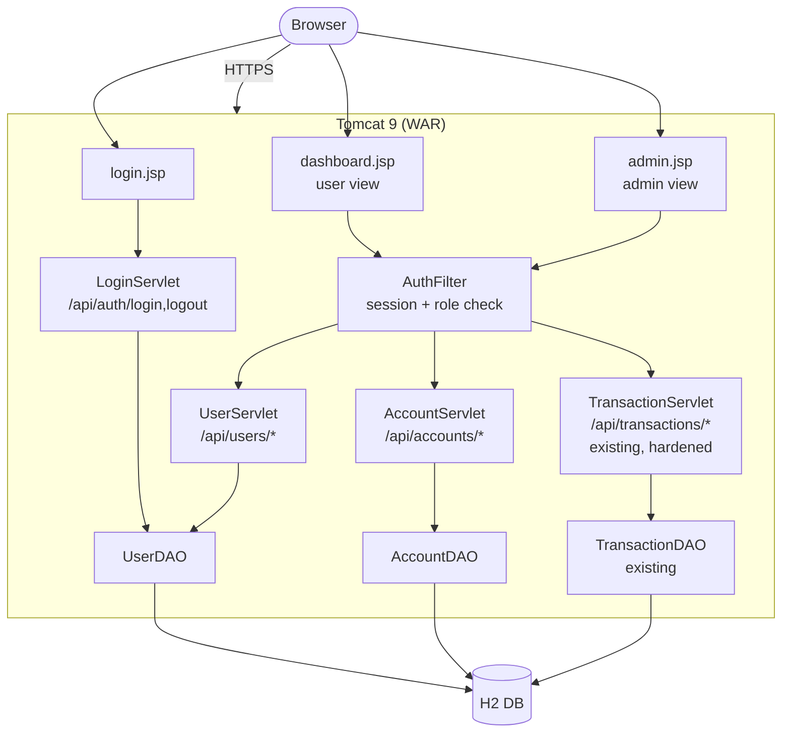
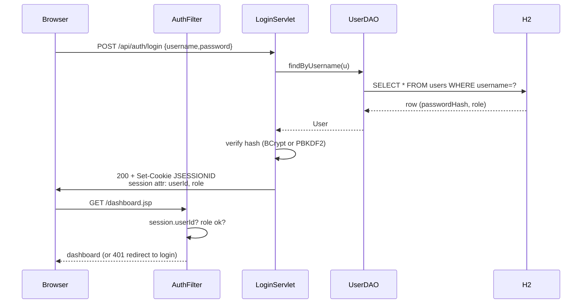
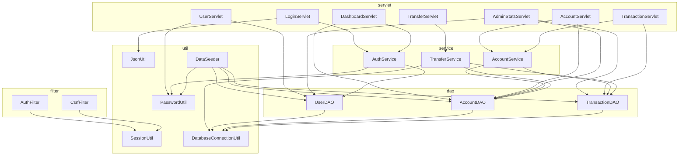

# Proposal: Login + Banking UX Enhancements — *Pragati Bank*

This document proposes changes to evolve the **Banking Transaction Analyzer** from an open transaction-CRUD demo into a small, credible **online banking demo** with a login screen and two roles: **user** and **admin**. Scope is intentionally kept small — this is a **college student project**, so simplicity, clear naming, and a clean package layout matter more than production hardening.

> Status: Proposal only. No code changes are implemented yet.

## 0. Brand — *Pragati Bank*

The demo will be branded as **Pragati Bank** (प्रगति बैंक).

- **Tagline (Hindi):** *आपकी प्रगति, हमारी ज़िम्मेदारी।*
- **Tagline (English):** *Your progress, our responsibility.*

Why this name:
- *Pragati* = **progress / growth** — aspirational, instantly recognised in the Indian context.
- Reads like a real co-operative / regional bank; sounds credible in a project viva.
- Pairs naturally with INR (₹) which the existing UI already uses.
- Allows a clean **rising-sun + upward-arrow** logo mark in **saffron + deep blue**, no asset pipeline needed.

**Logo:** see [src/main/webapp/assets/pragati-logo.svg](src/main/webapp/assets/pragati-logo.svg) — single self-contained SVG, no external fonts or images. Drop it into the header of every page.

Color palette:

| Token | Hex | Use |
|-------|-----|-----|
| `--brand-saffron` | `#F28C28` | Logo sun, primary buttons, highlights |
| `--brand-navy` | `#0B3D6E` | Header bar, headings, text on light bg |
| `--brand-gold` | `#C9A227` | Accents, badges, divider lines |
| `--brand-bg` | `#F7F4ED` | Page background (warm off-white) |
| `--success` | `#1a7f3c` | Credit amounts (kept from current UI) |
| `--danger` | `#c0392b` | Debit amounts (kept from current UI) |

Alternative names that were on the shortlist (kept here for reference only): *Sampoorna*, *Bharat Trust*, *Setu*, *Arthik*, *Vriddhi*, *Suraksha*. Throughout the rest of this document, **Pragati Bank** is used.

---

## 1. Current State (recap)

| Layer | Today |
|-------|-------|
| UI | Single `app.jsp` page — anyone can see/add/edit any transaction |
| API | `TransactionServlet` exposes full CRUD on `/api/transactions/*`, no auth |
| Data | One H2 table: `transactions` |
| Auth | None — no users, no sessions, no roles |
| Account | Account number is a free-text input field (`ACC001`) |

**Gap for a banking demo:** no notion of identity, ownership, or privileged operations.

---

## 2. Goals

1. Add a **login screen** as the entry point.
2. Support two roles:
   - **USER** — sees only their own account(s) and transactions; can deposit/withdraw/transfer.
   - **ADMIN** — sees all users and all transactions; can create users, freeze accounts, view system stats.
3. Add a handful of **simple banking touches** to make the demo feel like a bank site (dashboard, transfer, statement, etc.).
4. Keep stack unchanged: servlets + JSP + JDBC + H2. No Spring, no JWT libraries.

Non-goals: real security, password reset flows, KYC, multi-currency, OTP, audit compliance.

---

## 3. Proposed Architecture



### Login sequence



---

## 4. Data Model Changes

Two new tables; the existing `transactions` table gets a foreign key.

```sql
CREATE TABLE users (
    id            INT PRIMARY KEY AUTO_INCREMENT,
    username      VARCHAR(50)  NOT NULL UNIQUE,
    password_hash VARCHAR(255) NOT NULL,    -- BCrypt / PBKDF2, never plaintext
    full_name     VARCHAR(100) NOT NULL,
    role          VARCHAR(20)  NOT NULL,    -- 'USER' | 'ADMIN'
    status        VARCHAR(20)  NOT NULL DEFAULT 'ACTIVE',  -- ACTIVE | LOCKED
    created_at    TIMESTAMP DEFAULT CURRENT_TIMESTAMP
);

CREATE TABLE accounts (
    account_number VARCHAR(50) PRIMARY KEY,
    user_id        INT NOT NULL,
    account_type   VARCHAR(20) NOT NULL,    -- SAVINGS | CHECKING
    status         VARCHAR(20) NOT NULL DEFAULT 'ACTIVE',  -- ACTIVE | FROZEN
    opened_at      TIMESTAMP DEFAULT CURRENT_TIMESTAMP,
    FOREIGN KEY (user_id) REFERENCES users(id)
);

-- existing transactions table: add ownership link
ALTER TABLE transactions
    ADD CONSTRAINT fk_tx_account
    FOREIGN KEY (account_number) REFERENCES accounts(account_number);
```

**Seed data** (loaded by `ApplicationInitializationListener` if `users` is empty):

| username | password (demo) | role  | accounts        |
|----------|-----------------|-------|-----------------|
| admin    | admin123        | ADMIN | —               |
| alice    | alice123        | USER  | ACC001          |
| bob      | bob123          | USER  | ACC002, ACC003  |

---

## 5. Backend Changes

### 5.0 Package Layout (clear separation of concerns)

Because this is a college project, the code is organized so each class has **one clear job** and beginners can read it top-to-bottom. Layering follows the classic **MVC + DAO** pattern already used in the existing code, just expanded.

```
com.pragatibank
├── model/          ← plain Java data classes (POJOs). No logic, just fields + getters/setters.
│   ├── User.java
│   ├── Account.java
│   └── Transaction.java         (existing)
│
├── dao/            ← database access only. One DAO per table. SQL lives here, nowhere else.
│   ├── UserDAO.java
│   ├── AccountDAO.java
│   └── TransactionDAO.java      (existing, extended)
│
├── service/        ← business rules. Combines multiple DAOs in one operation.
│   ├── AuthService.java         (login, hash check, session attrs)
│   ├── AccountService.java      (deposit, withdraw, freeze checks)
│   └── TransferService.java     (two-leg transfer in a single DB transaction)
│
├── servlet/        ← HTTP layer only. Parse request → call service → write JSON. No SQL here.
│   ├── LoginServlet.java
│   ├── LogoutServlet.java
│   ├── DashboardServlet.java
│   ├── AccountServlet.java
│   ├── TransferServlet.java
│   ├── UserServlet.java         (admin)
│   ├── AdminStatsServlet.java   (admin)
│   ├── TransactionServlet.java  (existing, hardened)
│   └── ApplicationInitializationListener.java  (existing)
│
├── filter/         ← cross-cutting concerns (auth, CSRF). Run before servlets.
│   ├── AuthFilter.java
│   └── CsrfFilter.java
│
└── util/           ← small stateless helpers.
    ├── DatabaseConnectionUtil.java  (existing)
    ├── PasswordUtil.java            (BCrypt wrapper)
    ├── JsonUtil.java                (shared Gson instance + date adapters)
    └── SessionUtil.java             (read userId/role from HttpSession)\n```\n\n**Golden rules (easy to remember for the report / viva):**\n\n| Layer    | Allowed to call | NOT allowed |\n|----------|-----------------|-------------|\n| servlet  | service, util   | DAO directly, SQL strings |\n| service  | dao, util       | HttpServletRequest/Response |\n| dao      | util (DB only)  | service, servlet |\n| model    | nothing         | everything (pure data) |\n| util     | nothing         | service, dao, servlet |\n\nThis means a student reading `LoginServlet.java` sees only request parsing + a call to `AuthService.login(...)`. The SQL lives in `UserDAO`. The hashing lives in `PasswordUtil`. Each file is short and does one thing.\n\n**Why a `service` layer is new (it didn't exist before):** the current code calls DAO directly from the servlet. That was fine for simple CRUD. Once we add rules like *\"can't withdraw from a frozen account\"* or *\"transfer = debit one account AND credit another in one DB transaction\"*, those rules don't belong in HTTP code or in SQL code \u2014 they belong in a service.\n\n### 5.1 New components — detailed design

Each class below follows the same template used in [DESIGN.md](DESIGN.md): **Package · Role · Key methods · Notes**. Read top-to-bottom — every class does *one* thing, with the method names chosen to read like English sentences a student can explain in a viva.

---

#### 5.1.1 `User` (Model)

| Aspect | Detail |
|--------|--------|
| Package | `com.pragatibank.model` |
| Role | Domain object representing one login identity in Pragati Bank. |
| Fields | `id`, `username`, `passwordHash`, `fullName`, `role` (`USER`/`ADMIN`), `status` (`ACTIVE`/`LOCKED`), `createdAt` |
| Notes | Pure POJO — fields + getters/setters only. **`passwordHash` is never sent to the client** (custom Gson exclusion or transient flag). |

---

#### 5.1.2 `Account` (Model)

| Aspect | Detail |
|--------|--------|
| Package | `com.pragatibank.model` |
| Role | Domain object representing one bank account that belongs to a `User`. |
| Fields | `accountNumber`, `userId`, `accountType` (`SAVINGS`/`CHECKING`), `status` (`ACTIVE`/`FROZEN`), `openedAt` |
| Notes | One user → many accounts. The link to `Transaction` is through `accountNumber`. |

---

#### 5.1.3 `Transaction` (Model — existing, unchanged)

| Aspect | Detail |
|--------|--------|
| Package | `com.pragatibank.model` |
| Role | Same as today: one CREDIT or DEBIT row. |
| Note for proposal | `balanceAfter` will now be **server-computed** during save (not trusted from client). |

---

#### 5.1.4 `UserDAO` (Data Access)

| Aspect | Detail |
|--------|--------|
| Package | `com.pragatibank.dao` |
| Role | All SQL against the `users` table. No business logic. |
| Key methods | `findByUsername(String) → User`<br>`findById(long) → User`<br>`listAll() → List<User>`<br>`save(User) → long` (insert, returns generated id)<br>`updateStatus(long id, String status) → boolean`<br>`countAll() → int` (for admin stats) |
| Security | All queries use `PreparedStatement`. Returns `null` when no row found. |
| Error handling | Catches `SQLException`, logs via `java.util.logging`. Same pattern as existing `TransactionDAO`. |

---

#### 5.1.5 `AccountDAO` (Data Access)

| Aspect | Detail |
|--------|--------|
| Package | `com.pragatibank.dao` |
| Role | All SQL against the `accounts` table. |
| Key methods | `findByNumber(String) → Account`<br>`findByUserId(long) → List<Account>`<br>`save(Account) → boolean`<br>`updateStatus(String acctNo, String status) → boolean`<br>`isOwnedBy(String acctNo, long userId) → boolean` — **ownership check used by services** |
| Notes | `isOwnedBy` is the single source of truth for "can this user touch this account?" Used by `AccountService` and `TransferService`. |

---

#### 5.1.6 `TransactionDAO` (Data Access — existing, extended)

| Aspect | Detail |
|--------|--------|
| Package | `com.pragatibank.dao` |
| Role | Same as today, plus a few additions. |
| New methods | `saveInConnection(Transaction, Connection) → long` — used by `TransferService` so two inserts share one DB transaction.<br>`countAll() → int` and `sumAllBalances() → BigDecimal` for admin stats. |
| Existing methods | `getAllTransactions`, `getTransactionById`, `getTransactionsByAccount`, `saveTransaction`, `updateTransaction`, `deleteTransaction`, `getTotalCredits`, `getTotalDebits` — unchanged. |

---

#### 5.1.7 `AuthService` (Service)

| Aspect | Detail |
|--------|--------|
| Package | `com.pragatibank.service` |
| Role | The login brain. Sits between `LoginServlet` and `UserDAO`. |
| Key methods | `login(String username, String password, HttpSession session) → User` — looks up user, verifies BCrypt hash, checks `status=ACTIVE`, stores `userId` + `role` in session.<br>`logout(HttpSession session) → void` — invalidates session.<br>`currentUser(HttpSession session) → User` — convenience getter using `userId` attribute. |
| Throws | `AuthenticationException` (custom, simple `RuntimeException`) on bad credentials or locked account — caught by servlet and turned into `401`. |
| Notes | Knows **nothing** about HTTP requests/responses — only the `HttpSession` (acceptable boundary). Easy to unit-test. |

---

#### 5.1.8 `AccountService` (Service)

| Aspect | Detail |
|--------|--------|
| Package | `com.pragatibank.service` |
| Role | Business rules for deposit/withdraw on a single account. |
| Key methods | `deposit(String acctNo, BigDecimal amount, String desc, long actingUserId, boolean isAdmin) → Transaction`<br>`withdraw(String acctNo, BigDecimal amount, String desc, long actingUserId, boolean isAdmin) → Transaction`<br>`getBalance(String acctNo) → BigDecimal` |
| Rules enforced | 1. amount > 0<br>2. account exists and is `ACTIVE` (not `FROZEN`)<br>3. ownership: USER must own the account; ADMIN bypasses<br>4. withdraw: balance ≥ amount (no overdraft in this demo)<br>5. computes `balanceAfter` server-side, then calls `TransactionDAO.saveTransaction(...)` |
| Throws | `BusinessException` (simple checked-style) with a message servlet maps to `400`. |

---

#### 5.1.9 `TransferService` (Service)

| Aspect | Detail |
|--------|--------|
| Package | `com.pragatibank.service` |
| Role | Move money between two accounts atomically. |
| Key method | `transfer(String fromAcct, String toAcct, BigDecimal amount, String desc, long actingUserId, boolean isAdmin) → TransferReceipt` |
| How it works | Opens **one JDBC `Connection`** with `setAutoCommit(false)` → calls `TransactionDAO.saveInConnection` twice (DEBIT from-account, CREDIT to-account) → `commit()` on success, `rollback()` on any exception, `close()` in `finally`. |
| Rules enforced | Both accounts exist, both `ACTIVE`, `fromAcct != toAcct`, sufficient balance, ownership of `fromAcct` for USER. |
| Why a service, not the DAO | Atomicity spans **two SQL statements** + business checks. That's a service concern, not a single-table concern. |

---

#### 5.1.10 `PasswordUtil` (Util)

| Aspect | Detail |
|--------|--------|
| Package | `com.pragatibank.util` |
| Role | One-line wrapper over BCrypt so nobody is tempted to roll their own crypto. |
| Key methods | `static String hash(String plain)` → `BCrypt.hashpw(plain, BCrypt.gensalt(10))`<br>`static boolean verify(String plain, String hash)` → `BCrypt.checkpw(plain, hash)` |
| Notes | Salt is embedded in the hash by BCrypt — no separate salt column needed. Cost factor 10 is fine for a demo. |

---

#### 5.1.11 `SessionUtil` (Util)

| Aspect | Detail |
|--------|--------|
| Package | `com.pragatibank.util` |
| Role | Single place that reads auth attributes from `HttpSession`. Avoids `(Long) session.getAttribute("userId")` casts scattered across servlets. |
| Key methods | `static Long getUserId(HttpServletRequest)` (null if not logged in)<br>`static String getRole(HttpServletRequest)`<br>`static boolean isAdmin(HttpServletRequest)`<br>`static boolean isLoggedIn(HttpServletRequest)` |
| Notes | Stateless. No DB access. |

---

#### 5.1.12 `JsonUtil` (Util)

| Aspect | Detail |
|--------|--------|
| Package | `com.pragatibank.util` |
| Role | Single shared `Gson` instance with `LocalDateTime` adapters. Today this is duplicated inside `TransactionServlet.init()` — move it here. |
| Key methods | `static Gson gson()` — returns the shared instance.<br>`static <T> T fromJson(HttpServletRequest, Class<T>)` and `static void writeJson(HttpServletResponse, Object)` helpers. |

---

#### 5.1.13 `LoginServlet` (Servlet)

| Aspect | Detail |
|--------|--------|
| Package | `com.pragatibank.servlet` |
| URL pattern | `/api/auth/login` |
| Role | Read JSON `{username, password}` → call `AuthService.login()` → return `{user, redirectTo}` or 401. |
| HTTP methods | `POST` only (others → 405). |
| What students will see | ~30 lines of code. Almost nothing happens here — the work is in `AuthService`. |

---

#### 5.1.14 `LogoutServlet` (Servlet)

| Aspect | Detail |
|--------|--------|
| Package | `com.pragatibank.servlet` |
| URL pattern | `/api/auth/logout` |
| Role | `POST` → `AuthService.logout(session)` → 200. |

---

#### 5.1.15 `DashboardServlet` (Servlet)

| Aspect | Detail |
|--------|--------|
| Package | `com.pragatibank.servlet` |
| URL pattern | `/api/auth/me` |
| Role | Return the currently logged-in user + their accounts + balances. The dashboard JSP calls this on load. |
| Response shape | `{ user: {...}, accounts: [{number, type, status, balance}, ...] }` |

---

#### 5.1.16 `AccountServlet` (Servlet)

| Aspect | Detail |
|--------|--------|
| Package | `com.pragatibank.servlet` |
| URL pattern | `/api/accounts`, `/api/accounts/*` |
| Role | Thin HTTP wrapper over `AccountService` and `AccountDAO`. |
| Endpoints | `GET /api/accounts` → list (own for USER, all for ADMIN)<br>`POST /api/accounts/{acct}/deposit`<br>`POST /api/accounts/{acct}/withdraw`<br>`PUT  /api/accounts/{acct}/status` (ADMIN only) |

---

#### 5.1.17 `TransferServlet` (Servlet)

| Aspect | Detail |
|--------|--------|
| Package | `com.pragatibank.servlet` |
| URL pattern | `/api/transfers` |
| Role | `POST` with `{fromAccount, toAccount, amount, description}` → calls `TransferService.transfer(...)` → returns the two created transactions as a receipt. |

---

#### 5.1.18 `UserServlet` (Servlet — admin only)

| Aspect | Detail |
|--------|--------|
| Package | `com.pragatibank.servlet` |
| URL pattern | `/api/users`, `/api/users/*` |
| Role | Admin user management. |
| Endpoints | `GET /api/users` — list all<br>`POST /api/users` — create user (hashes password via `PasswordUtil`) + optional initial account<br>`PUT /api/users/{id}/status` — lock/unlock |
| Guard | `AuthFilter` rejects non-admin before this servlet runs. Defence in depth: the servlet re-checks `SessionUtil.isAdmin(req)`. |

---

#### 5.1.19 `AdminStatsServlet` (Servlet — admin only)

| Aspect | Detail |
|--------|--------|
| Package | `com.pragatibank.servlet` |
| URL pattern | `/api/admin/stats` |
| Role | `GET` → returns 4 KPI numbers used by the admin Stats tab. |
| Response | `{ totalUsers, totalAccounts, totalTransactions, systemBalance }` |

---

#### 5.1.20 `TransactionServlet` (Servlet — existing, hardened)

| Aspect | Detail |
|--------|--------|
| Package | `com.pragatibank.servlet` |
| URL pattern | `/api/transactions`, `/api/transactions/*` (unchanged) |
| Changes from today | 1. Uses `JsonUtil.gson()` instead of building its own.<br>2. Reads `userId`/`role` from `SessionUtil`.<br>3. For USER: filters all queries to accounts owned by `userId`.<br>4. On `POST`: rejects negative/zero amounts and computes `balanceAfter` server-side via `AccountService`.<br>5. Direct `POST`/`PUT`/`DELETE` are restricted to ADMIN (regular users should use deposit/withdraw/transfer endpoints). |

---

#### 5.1.21 `ApplicationInitializationListener` (Lifecycle — existing, extended)

| Aspect | Detail |
|--------|--------|
| Package | `com.pragatibank.servlet` |
| Role | Same as today (creates `transactions` table) **plus** creates `users` + `accounts` tables and seeds the three demo users if the `users` table is empty. |
| Seed step | Calls a new `DataSeeder` helper (in `util`) so `contextInitialized()` stays a 4-line method. |

---

#### 5.1.22 `AuthFilter` (Filter)

| Aspect | Detail |
|--------|--------|
| Package | `com.pragatibank.filter` |
| Mapped to | `/api/*` and protected JSPs (`/dashboard.jsp`, `/admin.jsp`, `/statement.jsp`, `/app.jsp`) |
| Bypass list | `/api/auth/login`, `/login.jsp`, `/index.html`, `/assets/*` |
| Role | Runs **before** every protected request. Reads `HttpSession`. |
| Behaviour | No session → `401` JSON for `/api/*`, `302 redirect /login.jsp` for pages.<br>Role mismatch (USER on `/api/users` or `/api/admin/*`) → `403`.<br>Otherwise → `chain.doFilter(...)`. |

---

#### 5.1.23 `CsrfFilter` (Filter)

| Aspect | Detail |
|--------|--------|
| Package | `com.pragatibank.filter` |
| Mapped to | `/api/*` |
| Role | For `POST/PUT/DELETE`, compares `X-CSRF-Token` header with the token stored in `HttpSession` at login time. Mismatch → `403`. |
| Notes | Token is generated in `AuthService.login()` (`UUID.randomUUID().toString()`) and returned in the login response so the JS can echo it. |

---

#### 5.1.24 `DataSeeder` (Util)

| Aspect | Detail |
|--------|--------|
| Package | `com.pragatibank.util` |
| Role | Inserts the three demo users + their accounts + a handful of starter transactions, **only if the `users` table is empty**. |
| Why a separate class | Keeps `ApplicationInitializationListener` tiny and makes the seed data easy to find/edit. |
| Key method | `static void seedIfEmpty()` — called once at startup. |

---

### 5.2 Class-interaction diagram (who calls whom)



Rule of thumb for the student reading this diagram: **arrows always point from a higher layer to a lower layer** — `servlet → service → dao → util/db`. Never the other way around.

---

### 5.3 Session-based auth (simple)

- On successful login: `request.getSession(true).setAttribute("userId", ...)` and `"role"`.
- Logout: `session.invalidate()`.
- `AuthFilter` mapped to `/api/*` (except `/api/auth/login`) and protected JSPs:
  - No session → `401` for API, redirect to `login.jsp` for pages.
  - Role mismatch (USER hitting admin endpoint) → `403`.

### 5.4 Hardening existing `TransactionServlet`

- Replace free-text account input with **server-derived ownership**: USER can only act on accounts owned by their `userId`. Verified in DAO with a `WHERE account_number IN (SELECT account_number FROM accounts WHERE user_id=?)` join.
- ADMIN bypasses the ownership check.
- Stop accepting `balanceAfter` from the client — compute it server-side from previous balance + amount. (Today the client sets it, which is wrong for a bank.)
- Reject negative amounts; validate `transactionType ∈ {CREDIT, DEBIT}`.

### 5.5 New endpoints

| Method | Path | Role | Purpose |
|--------|------|------|---------|
| POST | `/api/auth/login` | public | username+password → session |
| POST | `/api/auth/logout` | any | invalidate session |
| GET  | `/api/auth/me` | any | current user + accounts |
| GET  | `/api/accounts` | USER/ADMIN | list own (USER) or all (ADMIN) |
| POST | `/api/accounts/{acct}/deposit` | USER/ADMIN | `{amount, description}` |
| POST | `/api/accounts/{acct}/withdraw` | USER/ADMIN | `{amount, description}` |
| POST | `/api/transfers` | USER/ADMIN | `{from, to, amount, description}` — single DB tx with two rows |
| GET  | `/api/users` | ADMIN | list users |
| POST | `/api/users` | ADMIN | create user + initial account |
| PUT  | `/api/users/{id}/status` | ADMIN | lock/unlock user |
| PUT  | `/api/accounts/{acct}/status` | ADMIN | freeze/unfreeze account |
| GET  | `/api/admin/stats` | ADMIN | totals: #users, #accounts, #tx, system balance |

---

## 6. UI Changes

### 6.1 New page set

| Page | Audience | Notes |
|------|----------|-------|
| `login.jsp` | public | username + password, demo creds shown as hint |
| `dashboard.jsp` | USER | account cards, balance, deposit/withdraw, transfer, recent transactions |
| `statement.jsp` | USER | filterable transaction list (date range, type) + CSV download |
| `admin.jsp` | ADMIN | tabs: Users, Accounts, All Transactions, System Stats |
| `app.jsp` | — | keep as legacy/raw view, gated to ADMIN only |

### 6.2 Common chrome
- Top nav bar: bank name/logo, logged-in user name, **Logout** button.
- Role-based menu rendering: USER sees Dashboard/Statement; ADMIN sees Admin Console.
- Reuse existing purple gradient theme so it looks consistent.

### 6.3 Login screen (sketch)

```
┌────────────────────────────────┐
│   ☀️  Pragati Bank             │
│   आपकी प्रगति, हमारी ज़िम्मेदारी।   │
│                                │
│   Username  [____________]     │
│   Password  [____________]     │
│   [   Sign In   ]              │
│                                │
│   Demo: alice / alice123       │
│         admin / admin123       │
└────────────────────────────────┘
```

### 6.4 User dashboard sketch

- **Header strip:** "Welcome back, Alice" + last-login timestamp.
- **Account cards** (one per account): account number, type, balance, status badge.
- **Quick actions:** Deposit, Withdraw, Transfer (modal dialogs).
- **Recent transactions** (last 10) with type badges (already exist in `app.jsp`).
- Reuses existing stats grid (Credits / Debits / Balance) per selected account.
- Footer: *© Pragati Bank — Demo project. Not a real bank.*

### 6.5 Admin console sketch

- Tabs: **Users**, **Accounts**, **Transactions**, **Stats**.
- Users tab: table + "Add User" + lock/unlock buttons.
- Accounts tab: table + freeze/unfreeze, opens transactions for that account.
- Stats tab: 4 KPI tiles (total users, total accounts, total transactions, system balance).

---

## 7. "Looks like a bank" enhancements (small, high-impact)

Listed roughly by effort, cheapest first. Pick a few.

1. **Branding** — rebrand to **Pragati Bank** with rising-sun SVG logo, saffron/navy theme, favicon, Hindi + English tagline in header/footer.
2. **Masked account numbers** in lists (`ACC•••001`); full number only on detail view.
3. **Money formatting** — locale-aware `Intl.NumberFormat` for ₹ amounts (currently hard-coded `₹`).
4. **Transaction reference IDs** — show a friendly `TXN-2026-00042` alongside the numeric id.
5. **Transfer** as a first-class operation (two transactions in one DB transaction).
6. **Statement download** — CSV export of filtered transactions.
7. **Pagination** on the transaction table (server-side `LIMIT/OFFSET`).
8. **Search & filter** — by date range, type, min/max amount, description text.
9. **Running balance column** — computed from oldest → newest.
10. **Status badges** — green ACTIVE / red FROZEN on accounts.
11. **Empty/welcome state** — first-login screen with "No transactions yet — make your first deposit".
12. **Toast notifications** — replace the current inline status div with toasts.
13. **Dark mode toggle** — cosmetic only.
14. **Admin audit log table** — capture admin actions (`user_locked`, `account_frozen`) for the Stats tab.

---

## 8. Security Considerations (demo-appropriate)

This is a demo, not a real bank. Even so:

- **Hash passwords** — BCrypt (jbcrypt dep) or PBKDF2 with `javax.crypto`. Never store plaintext.
- **HttpOnly session cookie** already configured in `web.xml`; keep it, set `Secure` when behind HTTPS.
- **CSRF** — add a per-session token for state-changing endpoints (`POST/PUT/DELETE`). Include as hidden form field + `X-CSRF-Token` header.
- **Authorization checks in DAO/Servlet**, not only in UI (UI hiding a button is not security).
- **Input validation** — positive amounts, enum types, max length on description.
- **Lock CORS** — current `Access-Control-Allow-Origin: *` is fine for a demo, but should be removed or scoped once auth is in.
- **Rate limit login** — simple in-memory counter, lock account after N failed attempts.
- **Logging** — log auth successes/failures (without passwords).

Explicitly **out of scope** for this demo: TLS termination details, key rotation, KYC, regulatory audit, persistent rate-limit store, MFA.

---

## 9. Dependency Additions

| Dep | Purpose | Optional? |
|-----|---------|-----------|
| `org.mindrot:jbcrypt:0.4` | Password hashing | Recommended (PBKDF2 with JDK works too) |
| `jstl:jstl:1.2` | Cleaner JSPs for tables/loops | Optional |

No new framework (Spring, etc.) needed — keeps the demo's "plain servlets + JDBC" teaching value.

---

## 10. Migration Plan (suggested phases)

1. **Phase 1 — Schema & seed**: add `users` + `accounts` tables, seed admin + 2 users + 3 accounts.
2. **Phase 2 — Login**: `LoginServlet`, `AuthFilter`, `login.jsp`, logout. Existing pages start requiring auth.
3. **Phase 3 — Ownership enforcement**: tie transactions to user via account FK; rewrite `TransactionServlet` to filter by session user.
4. **Phase 4 — User dashboard**: `dashboard.jsp` with deposit/withdraw/transfer.
5. **Phase 5 — Admin console**: `admin.jsp` with user/account management + stats.
6. **Phase 6 — Polish**: branding, masking, CSV export, pagination, toasts.

Each phase is independently shippable and keeps the demo runnable.

---

## 11. Out of Scope

- Real authentication providers (OAuth, SSO, OIDC).
- Multi-currency, FX, interest accrual.
- Email/SMS, OTP/2FA.
- Loan, card, or KYC workflows.
- Migrating away from H2 (DAO is already portable; can be done later by swapping `DatabaseConnectionUtil`).

---

## 12. Decisions (previously open questions)

All questions resolved in favour of the recommended option:

| # | Decision | Rationale |
|---|----------|-----------|
| 1 | **Session cookies** (not JWT) | Simpler for a JSP-rendered student project; one line: `session.setAttribute("userId", ...)`. |
| 2 | ADMIN can **freeze/unfreeze and view only** — cannot post transactions on behalf of users | Cleaner role separation; easier to explain in a viva/demo. |
| 3 | Keep `app.jsp` as an **admin-only raw view** | Preserves existing functionality without cluttering the user dashboard. |
| 4 | Use **BCrypt** (`org.mindrot:jbcrypt`) for password hashing | One-line API (`BCrypt.hashpw` / `BCrypt.checkpw`), easy to explain, industry-standard name. |
