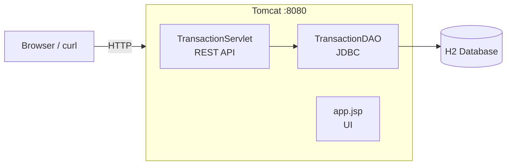
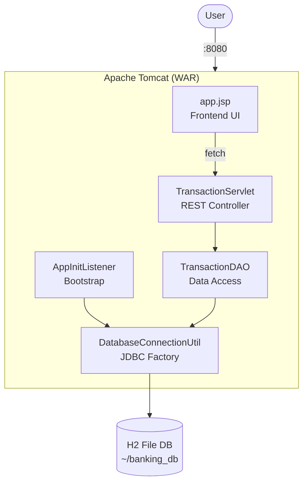

# Banking Transaction Analyzer

The Banking Transaction Analyzer is a servlet-based web application that provides a REST API and browser UI for managing and analyzing banking transactions. It follows a classic **three-tier architecture**: presentation (JSP/HTML), business logic (Servlet), and data access (DAO/JDBC), all packaged as a single WAR deployable on Apache Tomcat.

---

## Architecture

### System Overview



### Internal Component View



---

## Live Demo

Deployed on [Render](https://render.com): **https://fintrack-qo3w.onrender.com/transaction-analyzer**


---

## Prerequisites

- JDK 11+
- Maven 3.6+

---

## Build & Run

This project uses the **Cargo Maven plugin** to run locally. Cargo is a container-agnostic deployment tool that can download and manage servlet containers (Tomcat, Jetty, JBoss, etc.) directly from Maven — no separate server installation needed. It is configured to use **Tomcat 9.0.65**, the same version as the Docker image, so local and containerized behavior are consistent.

### Build & Run

```bash
mvn package cargo:run
```

This compiles the source, packages it into `target/transaction-analyzer.war`, and deploys it to Tomcat in one step. On first run, Cargo downloads Tomcat 9.0.65 (~10 MB) and caches it locally. Subsequent runs use the cache.

To skip tests:

```bash
mvn package cargo:run -DskipTests
```

App available at: http://localhost:8080/transaction-analyzer

---

## Docker

```bash
docker build -t banking-analyzer .
docker run -p 8080:8080 -v banking-data:/app/data banking-analyzer
```

---

## REST API

See [DESIGN.md — TransactionServlet](DESIGN.md#3-transactionservlet-rest-controller) for full API endpoint definitions, request/response examples, curl examples, and validation details.

Base path: `/transaction-analyzer/api/transactions`

---

## Database

H2 file-mode at `~/banking_db` — created automatically on first startup.

```sql
CREATE TABLE transactions (
    id               INT PRIMARY KEY AUTO_INCREMENT,
    account_number   VARCHAR(50)    NOT NULL,
    transaction_type VARCHAR(20)    NOT NULL,
    amount           DECIMAL(15, 2) NOT NULL,
    transaction_date TIMESTAMP      NOT NULL,
    description      VARCHAR(500),
    balance_after    DECIMAL(15, 2) NOT NULL,
    created_at       TIMESTAMP DEFAULT CURRENT_TIMESTAMP
);
```

---
