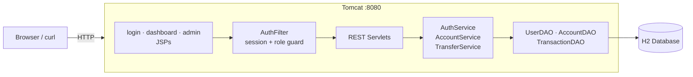
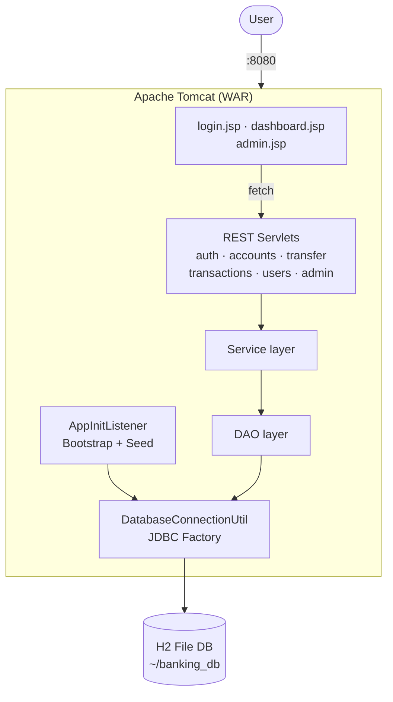

# Pragati Bank — Banking Transaction Analyzer

> *आपकी प्रगति, हमारी ज़िम्मेदारी।* — Your progress, our responsibility.

Pragati Bank is a fictitious Indian retail-banking demo built as a servlet-based web application. It provides a browser UI and REST API for customers (view balances, deposit, withdraw, transfer) and a separate admin console for bank staff (manage users and accounts, view KPIs). It follows a classic **layered architecture** — presentation (JSP), filter + servlet controllers, service layer, DAO/JDBC — all packaged as a single WAR deployable on Apache Tomcat.

---

## Architecture

### System Overview



### Internal Component View



See the [User Guide](USER_GUIDE.md) for screen walkthroughs and demo credentials, and [DESIGN.md](DESIGN.md) for full component, API and ER detail.

---

## Live Demo

Deployed on [Render](https://render.com): **https://fintrack-jyqj.onrender.com/transaction-analyzer/**

---

## Prerequisites

- JDK 11+
- Maven 3.6+

---

## Build & Run

This project uses the **Cargo Maven plugin** to run locally. Cargo is a container-agnostic deployment tool that can download and manage servlet containers (Tomcat, Jetty, JBoss, etc.) directly from Maven — no separate server installation needed. It is configured to use **Tomcat 9.0.65**, the same version as the Docker image, so local and containerized behavior are consistent.

### Build & Run

```bash
mvn package cargo:run
```

This compiles the source, packages it into `target/transaction-analyzer-1.0-SNAPSHOT.war`, and deploys it to Tomcat in one step. On first run, Cargo downloads Tomcat 9.0.65 (~10 MB) and caches it locally. Subsequent runs use the cache.

To skip tests:

```bash
mvn package cargo:run -DskipTests
```

App available at: http://localhost:8080/transaction-analyzer

Demo credentials are listed in the [User Guide](USER_GUIDE.md#getting-in).

---

## Docker

```bash
docker build -t pragati-bank .
docker run -p 8080:8080 -v pragati-data:/app/data pragati-bank
```

---

## REST API

See [DESIGN.md — REST API](DESIGN.md#rest-api) for the full list of endpoints (auth, accounts, transfer, transactions, users, admin), request/response examples and curl snippets.

Base path: `/transaction-analyzer/api`

---

## Database

H2 file-mode at `~/banking_db` — schema is created and seeded automatically on first startup. See [DESIGN.md — Data model](DESIGN.md#3-data-model) for the ER diagram and full DDL.

---
